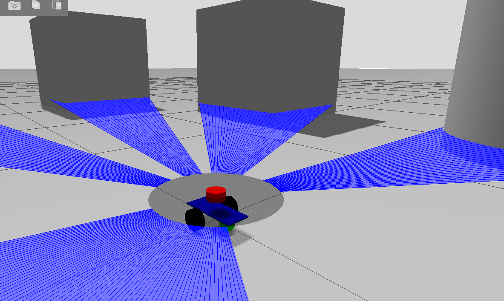
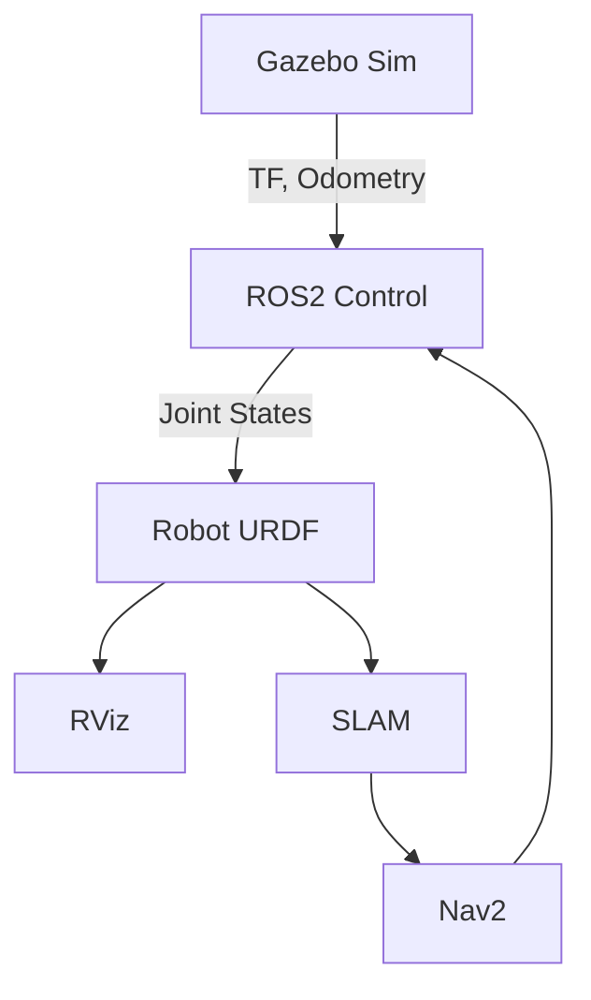

# ROS2 Симуляция мобильного робота

  
*Пример работы симуляции в Gazebo Harmonic*

## Содержание
1. [Описание проекта](#описание-проекта)
2. [Предварительные требования](#предварительные-требования)
3. [Установка и настройка](#установка-и-настройка)
4. [Запуск симуляции](#запуск-симуляции)
5. [Архитектура системы](#архитектура-системы)
6. [Настройка параметров](#настройка-параметров)

## Описание проекта

Этот репозиторий содержит полную систему для симуляции мобильного робота в ROS2 Jazzy с использованием:

- **Gazebo Harmonic** - физический движок и среда симуляции
- **ROS2 Control** - система управления роботом
- **RViz** - визуализация данных робота
- **SLAM Toolbox** - одновременная локализация и построение карты

## Предварительные требования

### Основное ПО
- **Ubuntu 22.04** (рекомендуется)
- **ROS2 Jazzy** ([официальная инструкция](https://docs.ros.org/en/jazzy/Installation.html))
- **Gazebo Harmonic** ([установка](https://gazebosim.org/docs/harmonic/install_ubuntu))

### Установка зависимостей ROS2
```bash
sudo apt update
sudo apt install -y \
    ros-jazzy-ros2-control \
    ros-jazzy-ros2-controllers \
    ros-jazzy-slam-toolbox \
    ros-jazzy-nav2-bringup \
    ros-jazzy-gazebo-ros-pkgs
```

## Установка и настройка

1. Создаем рабочее пространство:
```bash
mkdir -p ~/mino_ws/src
cd ~/mino_ws/src
```

2. Клонируем репозиторий:
```bash
git clone https://github.com/your_username/mino_robot_sim.git
```

3. Устанавливаем зависимости:
```bash
sudo apt update && rosdep update
rosdep install --from-paths . --ignore-src -y
```

4. Собираем проект:
```bash
cd ~/mino_ws
colcon build --symlink-install
```

5. Добавляем алиасы для удобства (в ~/.bashrc):
```bash
echo "source ~/mino_ws/install/setup.bash" >> ~/.bashrc
source ~/.bashrc
```

## Запуск симуляции

### Основные сценарии

1. **Полная симуляция** (Gazebo + ROS2 Control):
```bash
ros2 launch mino_gz mino_gz.launch.py
```

2. **Визуализация в RViz**:
```bash
ros2 launch mino_gz mino_gz_rviz.launch.py
```

3. **SLAM система**:
```bash
ros2 launch mino_slam mino_slam.launch.py
```

### Компоненты по отдельности

| Компонент | Команда |
|-----------|---------|
| Только Gazebo | `ros2 launch mino_gz mino_gz_sim.launch.py` |
| Только управление | `ros2 launch mino_gz mino_gz_control.launch.py` |
| robot_state_publisher | `ros2 launch mino_gz mino_gz_description.launch.py` |

## Архитектура системы



## Настройка параметров

Основные параметры можно менять через файлы конфигурации:

1. Параметры робота: `mino_description/config/Mino/*`
2. Настройки SLAM: `mino_slam/config/*`
3. Параметры RViz: `package_name/rviz/*`


---
**Разработчик**: [danya]  
**Контакты**: [boldov111@mail.ru]  
**Версия**: 1.0.0 (2024)
